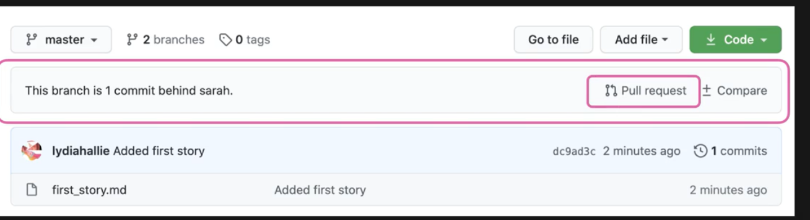
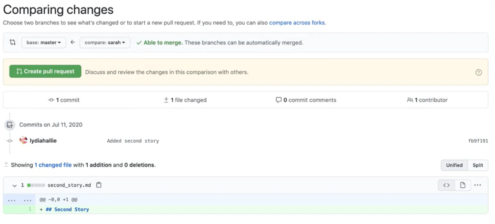
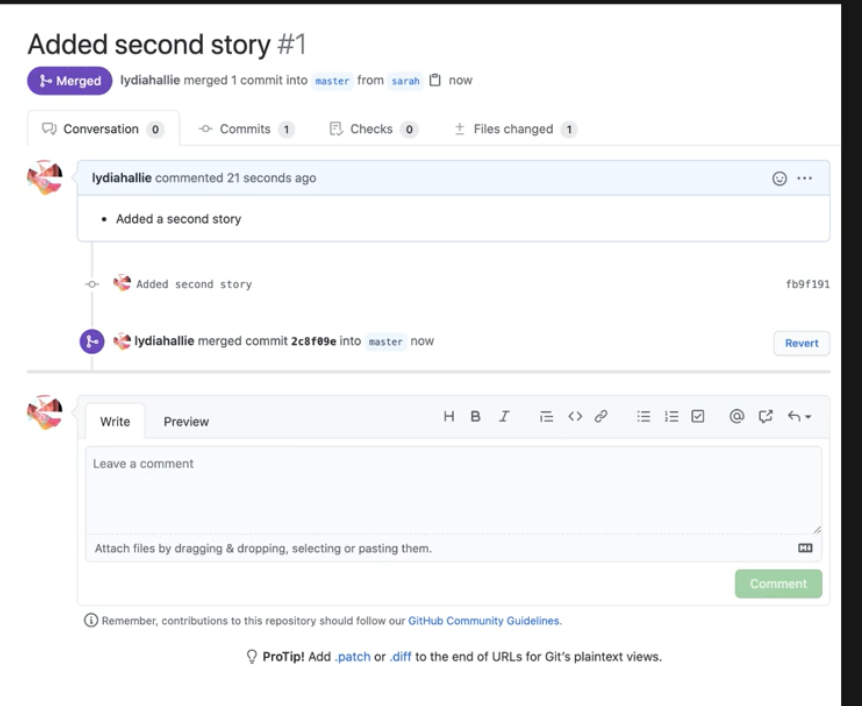

# Pull Requests

   
In this section, we will take a look at Pull requests


To push the latest changes to github nadeem branch
```
$ git push origin nadeem
```

To push changes from nadeem to master we have to open something called **`Pull Request`**

  

  

  
  


